### Hi there 👋

- 🔭 [QUANTAXIS](https://github.com/quantaxis/quantaxis) 作者
- 🌱 常用语言 rust/python/javascript/dart/go
- 👯 上海秉昊私募 基金经理 

- 💬 主要方向: 跨市场多资产复合中性策略
- 📫 微信ID: quantitativeanalysis  QQ: 279336410   

---以下为我常用维护的项目(带rs的为rust项目, 其余为python项目, 有部分没有开源 直接搜索即可)

- 历史数据, 多市场数据运维, 爬虫, 定时任务  ->  quantaxis.QAFetch .QASU / qadata-rs / qacron
- 实时数据, 采集分发, 数据推送 -> qamarket-rs/ qactpbeebroker/ qaotgbroker / qarealtimecollector / mifi/ qarealtime-rs/ qahexos-rs
- 数据结构, 指标, 多标的批量apply -> quantaxis.QADATASTUCT / quantaxis-rs/ qaindicator-rs
- 随机行情压力测试 -> QUANTAXIS_RandomPrice/ QAGanPrice

- 账户系统 (支持多市场) -> quantaxis/ qifi协议/ qifiaccount / quantaxis-rs
- 回测模板(可以自己替换) (更推荐用你自己的流程)   -> qastrategy
- 高性能回测[rust]  -> quantaxis-rs / qamom-rs/ qaruntime-rs/ qifimanager/ 
- 因子计算模板 调仓api -> qafactor-rs/ qafactor-rs_release/ QASTRATEGY101 
- 跨市场alpha框架 -> qaalpha-rs

- 模拟盘系统 -> qatradeG / qifiaccount / quantaxis-rs
- 实盘对接(股票/融资融券/篮子下单/算法交易/期货) ->  QAQMTBROKER/ qaoms-rs/ qatrader / qatrader-rs / qactpbeebroker / qaotgbroker
- 风控系统 -> qapbsystem / qariskpro
- 订单管理 / 跟单 -> qaoms-server / qaoms-rs
- 分仓位管理模块(单独核算)  -> quantaxis_pms

- web服务器  -> quantaxis_webserver
- 任务队列, 多机器的局域网任务分发, 调度, 实时定时任务 -> quantaxis_run/ quantaxis_unicorn
- 消息队列 -> qapubsub
- 自定义线程  -> quantaxis.QAThread
- 可视化  -> vifi协议, qamazing客户端

